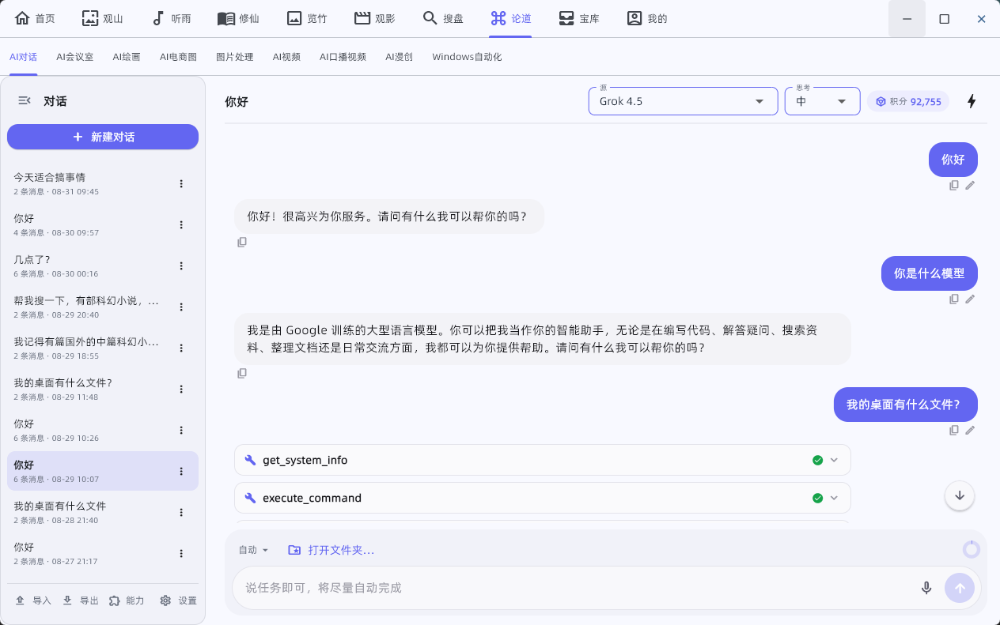
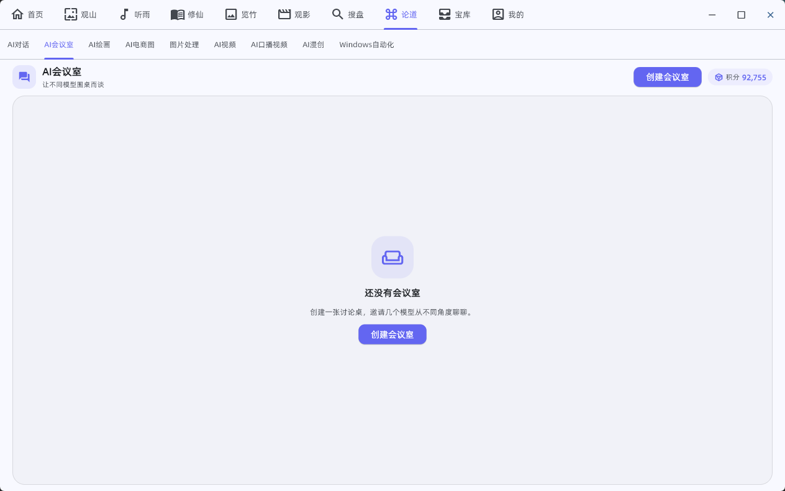
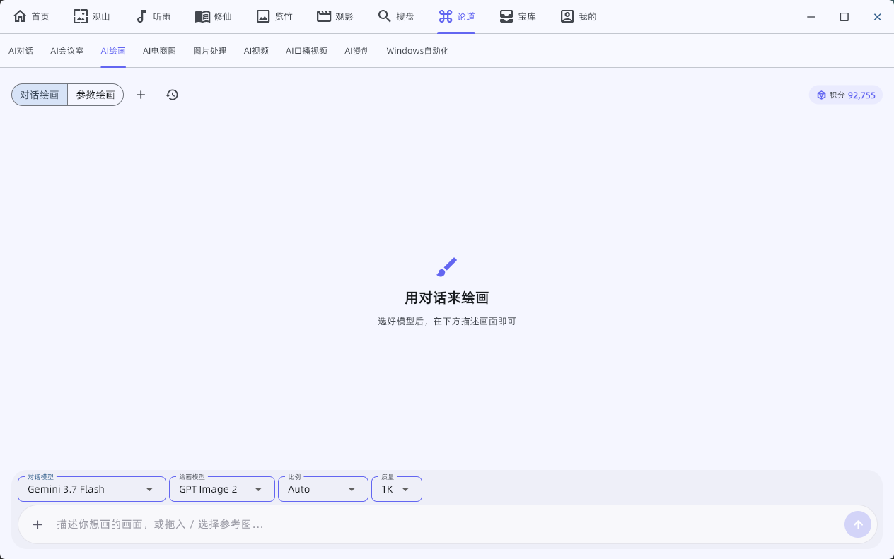
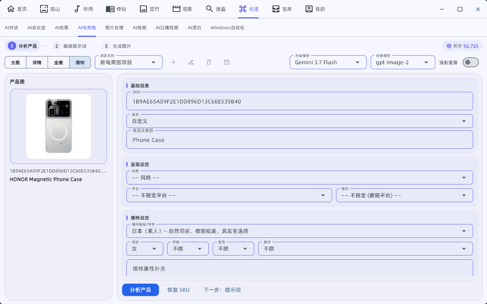
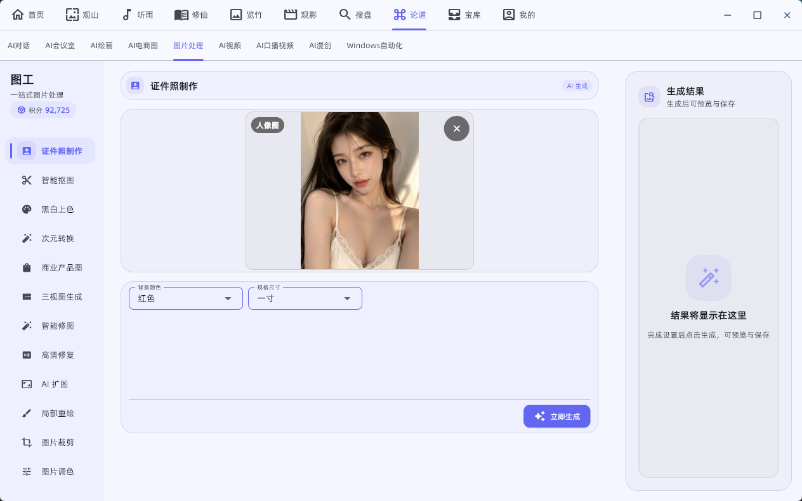
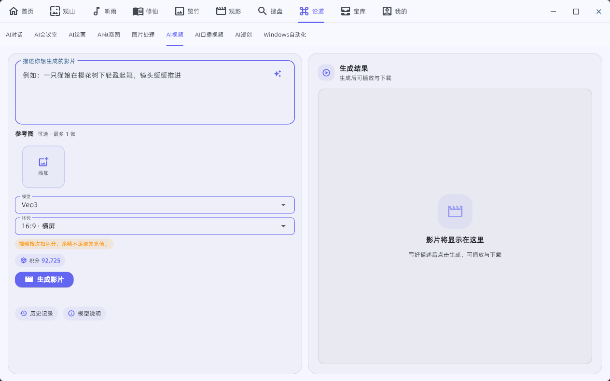
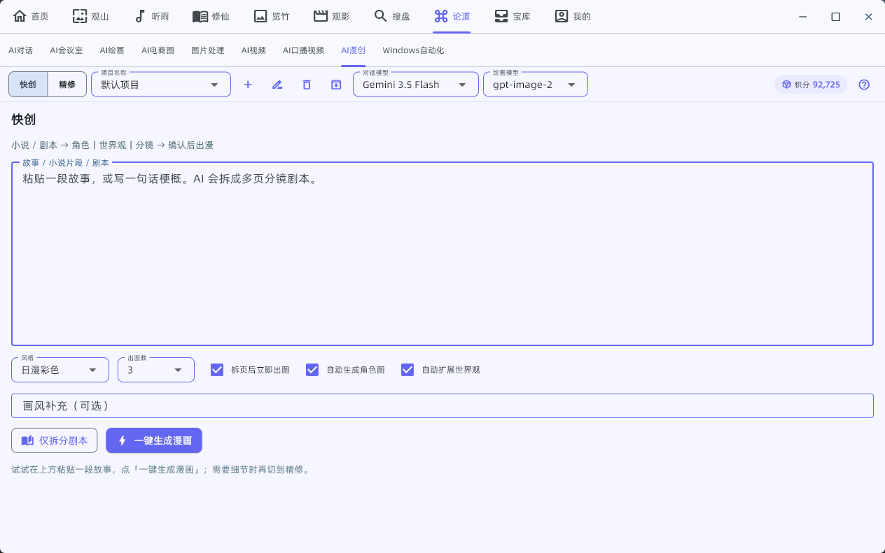
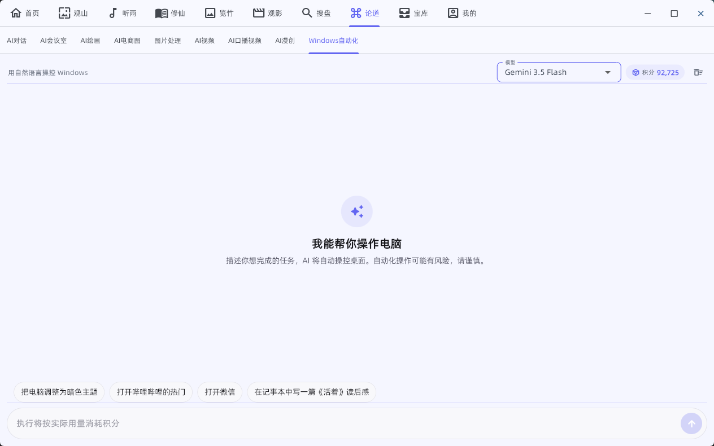
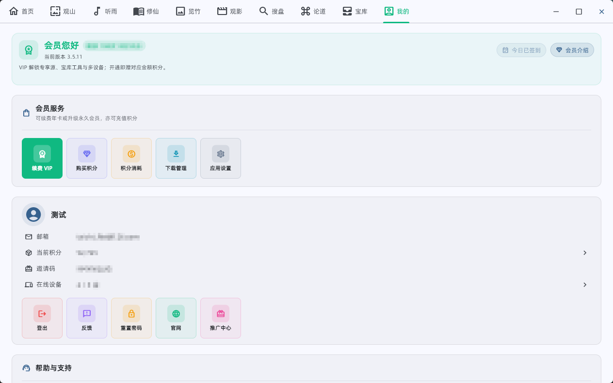

  

<h1 align="center">太极 TAICHI</h1>

  Windows 桌面多功能娱乐与创作应用

  
  

---

基于 [Flet](https://flet.dev/) 的 Windows 桌面应用。壁纸、音乐、小说、漫画、影视、网盘资源一站查找；论道提供对话、绘画、视频、口播与桌面自动化等 AI 能力。

界面简洁，功能集中。开源仓库已不再同步源码，**安装包持续更新**。

首次打开会有简短引导，可从主导航快速了解各模块。

## 下载

**最新版本 3.5.11**（2026 年 8 月 31 日）

为保证正常使用，请安装最新版。

电脑版下载：[https://moshangwangluo.com](https://moshangwangluo.com)

---

## 功能介绍

### 1. 首页

日期天气、热搜榜与公告入口。右上角可切换主题、打开全局设置；点击时间可选择默认壁纸。

### 2. 观山

浏览与下载高清壁纸、写真与摄影参考。可切换图源、左右翻看，下载到本地或设为壁纸，并调节背景模糊。开通 VIP 可解锁更多图源。

### 3. 听雨

多源搜歌、在线试听与下载。支持歌单、收藏、本地音乐、桌面歌词，以及导入歌单。开通 VIP 可解锁更多音乐源。

### 4. 修仙

搜索并阅读全网小说，支持书架收藏与云同步、沉浸阅读和听书。换设备也能接着看。

### 5. 览竹

搜索、阅读漫画，支持收藏，方便下次继续看。

### 6. 观影

检索影视资源，切换片源在线观看，支持收藏、观看历史与进度记忆。开通 VIP 可解锁更多片源。

### 7. 搜盘

按关键词搜索网盘分享与站源资源，复制链接或打开详情。开通 VIP 可解锁更多搜盘源。

### 8. 论道

AI 能力中心。登录后按积分使用；开通 VIP 另赠积分，并解锁更多资源源与工具。

#### AI 对话

问答与写作。助手可读写工作区、调用工具、记住偏好；支持对话 / 助手模式。

#### AI 会议室

创建房间，邀请多个模型围桌讨论同一话题。

#### AI 绘画

文字描述生成图片，支持参考图。模型含 Nano Banana、GPT Image 等（以软件内列表为准）。

#### AI 电商图

商品图辅助：分析商品 → 生成提示词 → 出图，适合电商场景。

#### 图片处理

证件照、智能抠图、上色、动漫化、扩图、局部重绘、裁剪与调色等。

#### AI 视频

文生视频，支持 Veo、Grok 等模型，可带参考图或首尾帧。

#### AI 漫创

一键辅助创作 AI 漫画（分镜与成稿）。

#### Windows 自动化

用自然语言描述任务，让 AI 协助操作电脑。

### 9. 宝库

几十种实用工具，分类包括：

- **办公影音**：PDF 转 Word、OCR、抠图、图片放大/清晰度、视频解析、TTS、二维码、待办等
- **桌面组件**：桌面时钟、闹钟、剪贴板、系统信息、太极小智、桌面 AI 助手
- **AI**：PPT 生成、起名、律师咨询等
- **小游戏**：扫雷、数独、拼图、记忆矩阵等

部分工具需 VIP。

### 10. 我的

注册登录、开通 VIP、购买积分、查看积分流水与消耗说明、下载管理、推广中心，以及账号与设备同步。

开通 VIP 可解锁更多图片 / 音乐 / 小说 / 漫画 / 影视 / 网盘来源（90+ 专享源），最多 3 台设备，记录与偏好随账号同步。

---

## 关注公众号了解更多

