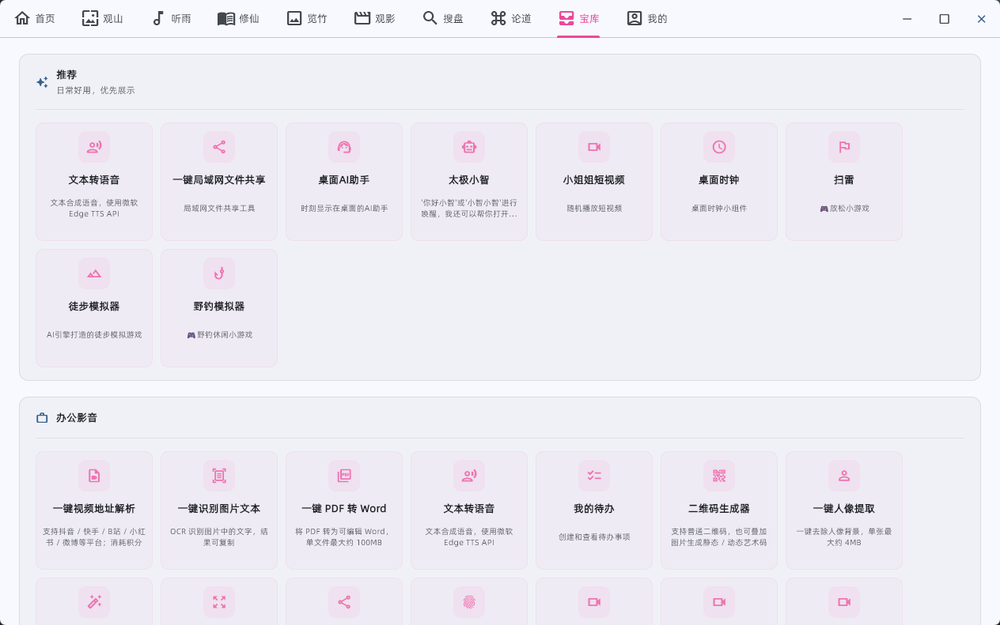

  

<h1 align="center">TAICHI-flet</h1>

  
  
  

---

 基于flet的一款windows桌面应用，实现了浏览图片、音乐、小说、各种资源的功能，还有gpt、ai绘画等高级功能。

 特点：多功能娱乐软件，界面美观、简洁。
 
 （开源代码已不更新，软件包持续更新中）
 
会持续更新

## 最新版本(2026年8月31日)

## 页面全新升级，欢迎使用

为保证太极正常使用，请【安装3.5.10版本】

电脑版《太极》3.5.10版本下载地址

[https://moshangwangluo.com](https://moshangwangluo.com)

---

## 功能介绍

1. 首页

右上角可切换主题、进行全局个性化设置、显示热搜榜，点击左上角时间可使用默认壁纸。

2. 观山——性感写真、清纯图片、风景壁纸、摄影参考一网打尽
   

右下角可选择下载、设为壁纸、调整壁纸模糊度等。

3. 听雨——全网音乐试听下载，自动搜索音乐源，导入歌单

4. 修仙—-免费阅读全网小说搜索、支持听书功能

5. 抚琴——云盘资源、软件资源搜索

6. 小站——资源、影视查找

7. 览竹——动漫搜索、观看

8. 论道——AI功能(高级功能)

### AI对话，支持多agent调用

### AI绘画，nano banana/2/pro，快速生图

### AI视频，sora2、veo3、grok视频生成

### AI 漫创，一键创作AI漫画

### windows自动化，让AI帮你智能操作电脑

9. 宝库——几十种实用工具

## 关注公众号了解更多功能

## Star历史

